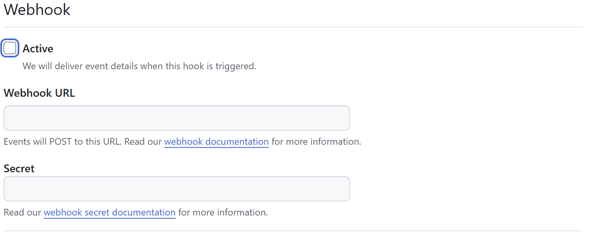
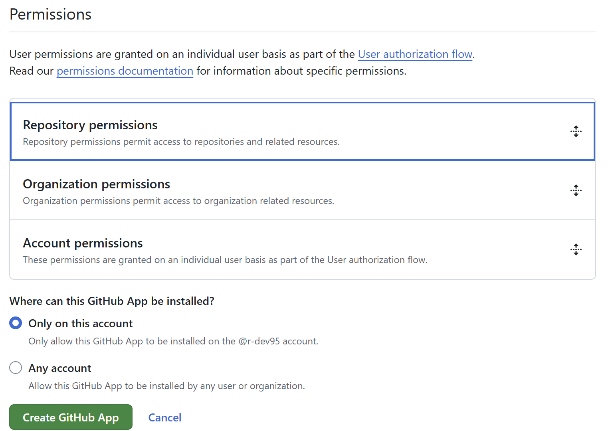

<!-- ============================================================
  Project Image
 ============================================================ -->
<div align=center>
  
  &nbsp;&nbsp;&nbsp;&nbsp;&nbsp;
  
  &nbsp;&nbsp;&nbsp;&nbsp;&nbsp;
  
  
</div>

<!-- ============================================================
  Overview
 ============================================================ -->

# :book:Overview

[](./README.md)
[](./README_JA.md)
[](./LICENSE)
[](https://zenn.dev/)
[](https://qiita.com/)

[](https://github.com/nodejs/node)
[](https://github.com/microsoft/TypeScript)

This repository provides Github Actions that convert the format of `Zenn` articles to `Qiita` articles (or vice versa) and push them to the target repository.

<!-- ============================================================
  Features
 ============================================================ -->

## :desktop_computer:Features

Either `Zenn` -> `Qiita` or `Qiita` -> `Zenn` is possible.

- Convert Markdown format
- Push the converted Markdown to the target repository

<!-- ============================================================
  Usage
 ============================================================ -->

## :keyboard:Usage

Here, we will explain it assuming `Zenn` -> `Qiita`.

If it is `Qiita` -> `Zenn`, please read it accordingly.

<div align=center>
  
</div>

### Create `Zenn` and `Qiita` repositories

Please create repositories to manage `Zenn` and `Qiita` articles.

Also, please configure the following settings.

- `Zenn`:

  - [Install Zenn CLI][zenn-cli]
  - [Connect Zenn to Github][zenn-github]

- `Qiita`:

  - [Install Qiita CLI][qiita-cli]
  - When you push to the repository, make sure you put files in the `public` directory so that they are reflected (for example, `.keep` files).

For both `Zenn` and `Qiita`, you can post by simply pushing to the repository, so we will use the official method for posting.

[zenn-cli]: https://zenn.dev/zenn/articles/install-zenn-cli
[zenn-github]: https://zenn.dev/zenn/articles/connect-to-github
[qiita-cli]: https://github.com/increments/qiita-cli

### Configure Github Apps

Configure Github Apps to have permissions to read and write the contents of the repository you're pushing to.

#### Create new

Create a new app by going to `Settings` -> `Developer Settings` -> `Github Apps` and clicking `New Github App`.

Set the `Github App name` and `Homepage URL`.

The `Github App name` is a global value, so make sure it is unique. For the `Homepage URL`, you can use any name, such as `https://example.com`.

<div align=center>
  
</div>

Since we do not use `WebHook`, we will uncheck it.

<div align=center>
  
</div>

Set the permissions for `Permissions` -> `Repository permissions` -> `Contents` to `Read and write`.

<div align=center>
  
</div>

#### Create a private key

Once creation is complete, you will be redirected to the Github Apps page you created.

Click `Generate a private key` under `Private keys` to download a file containing the private key.
This private key and the `App ID` under `About` will be used later.

#### Install Apps

Install Apps from `Install App` in the left menu.

Here, select only the `Qiita` repository from `Only select repositories`.

#### Configuring Repository Secrets

Set the secrets for the `Zenn` repository.

In the repository's `Settings` -> `Secrets and variables` -> `Actions`, set the following in `New repository secret`.

- `App ID` for Github Apps
- Private key for Github Apps

After setting, delete the private key file.

### Create a workflow file

Create a workflow file in the repository for `Zenn`.

Please set `<your ...>` and `<commit massage>`.

- Event settings
- Job settings
  - Execution environment settings
  - Generate Github Apps token
  - Check out the repository for `Zenn`
  - Check out the repository for `Qiita`
  - Run `zenn-qiita-actions`

<details>

<summary>workflow file</summary>

```yaml
name: Run zenn-qiita-actions

on:
  push:
    branches:
      - main
    paths:
      - articles/*.md

jobs:
  zenn-qiita-actions:
    runs-on: ubuntu-latest

    steps:
      - name: Generate GitHub Apps token
        id: generate
        uses: actions/create-github-app-token@v1
        with:
          owner: ${{ github.repository_owner }}
          app-id: ${{ secrets.<your Github Apps ID name> }}
          private-key: ${{ secrets.<your Github Apps Private Key name> }}

      - name: Checkout repository for Zenn
        uses: actions/checkout@v4
        with:
          path: <your repository name for Zenn>

      - name: Checkout repository for Qiita
        uses: actions/checkout@v4
        with:
          repository: r-dev95/<your repository name for Qiita>
          path: <your repository name for Qiita>
          ref: ${{ github.ref }}
          token: ${{ steps.generate.outputs.token }}
          persist-credentials: false

      - name: Run zenn-qiita-actions
        uses: r-dev95/zenn-qiita-actions@main
        with:
          zenn-path: <your repository name for Zenn>
          qiita-path: <your repository name for Qiita>
          push-to-path: <your repository name for Qiita>
          commit-msg: <commit massage>
          git-token: ${{ steps.generate.outputs.token }}
```

</details>

<!-- ============================================================
  Structure
 ============================================================ -->

<!-- ## :bookmark_tabs:Structure

<div align=center>
  
</div> -->

<!-- ============================================================
  License
 ============================================================ -->

## :key:License

This repository is licensed under the [MIT License](LICENSE).

[Zenn][Zenn] and [Qiita][Qiita] media kits are used in the README.

[Zenn]: (https://zenn.dev/mediakit)
[Qiita]: (https://help.qiita.com/ja/articles/others-brand-guideline)
