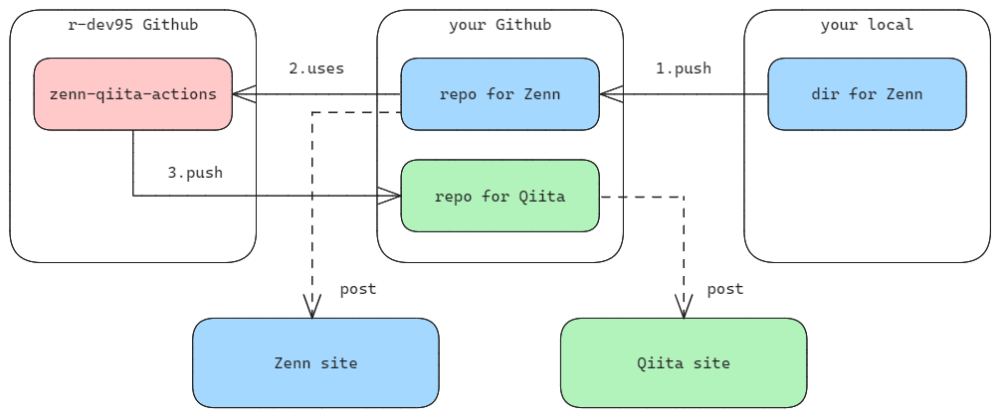
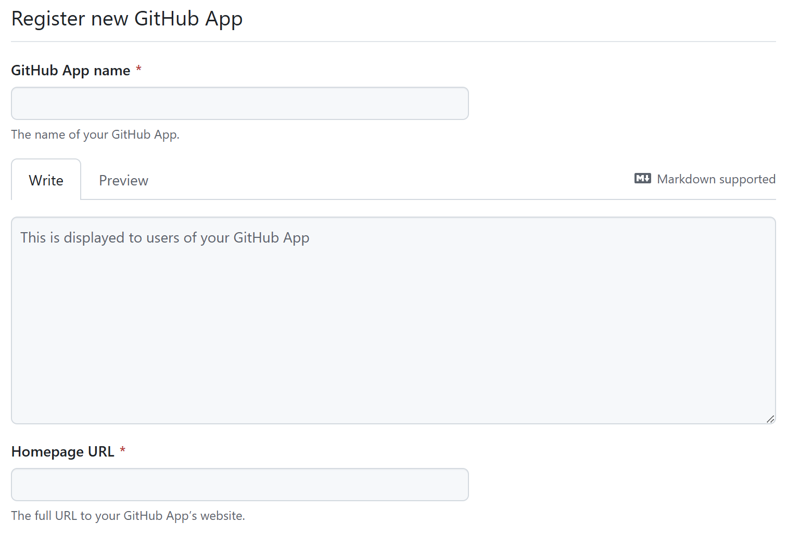
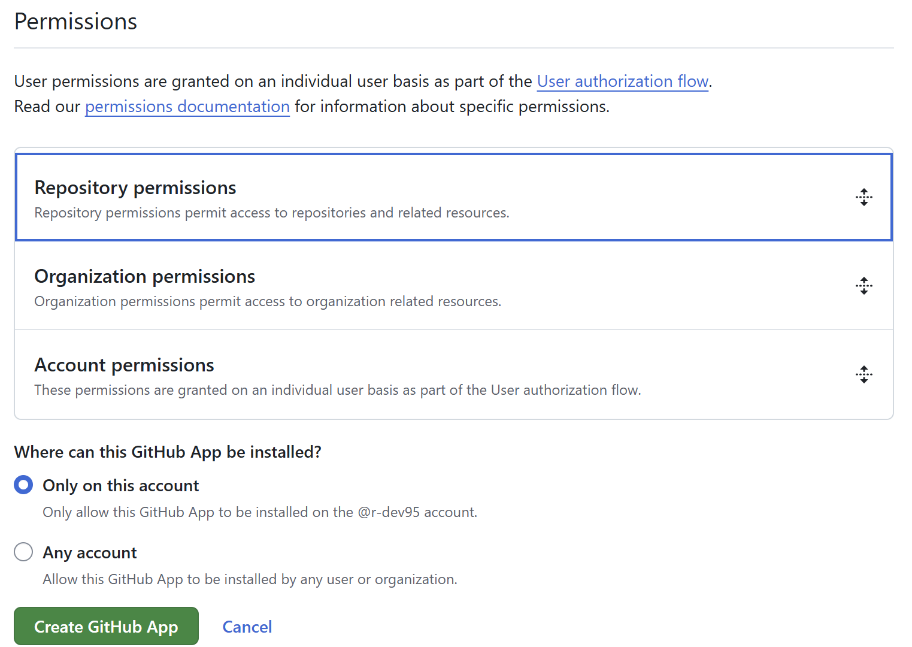

<!-- ============================================================
  Project Image
 ============================================================ -->
<div align=center>
  
  &nbsp;&nbsp;&nbsp;&nbsp;&nbsp;
  
  &nbsp;&nbsp;&nbsp;&nbsp;&nbsp;
  
  
</div>

<!-- ============================================================
  Overview
 ============================================================ -->

# :book:Overview

[](./README.md)
[](./README_JA.md)
[](./LICENSE)
[](https://zenn.dev/)
[](https://qiita.com/)

[](https://github.com/nodejs/node)
[](https://github.com/microsoft/TypeScript)

本リポジトリでは、`Zenn`の記事から`Qiita`の記事(またはその逆)にフォーマットを変換し、対象のリポジトリに push する Github Actions を提供します。

<!-- ============================================================
  Features
 ============================================================ -->

## :desktop_computer:Features

`Zenn` -> `Qiita`でも`Qiita` -> `Zenn`でもどちらでも可能です。

- Markdown フォーマットの変換
- 変換したマークダウンを対象リポジトリに push

<!-- ============================================================
  Usage
 ============================================================ -->

## :keyboard:Usage

ここでは、`Zenn` -> `Qiita`の想定で説明します。

`Qiita` -> `Zenn`の場合、読み替えてください。

<div align=center>
  
</div>

### `Zenn`と`Qiita`のリポジトリを作成

`Zenn`と`Qiita`の記事を管理するリポジトリをそれぞれ作成してください。

また下記、設定をそれぞれ行ってください。

- `Zenn`:

  - [Zenn CLI のインストール][zenn-cli]
  - [Zenn と Github の連携][zenn-github]

- `Qiita`:

  - [Qiita CLI のインストール][qiita-cli]
  - リポジトリに push した際、`public`ディレクトリも反映されるようにファイルを置いてください。(例えば、`.keep`ファイル)

`Zenn`、`Qiita`ともにリポジトリに push するだけで投稿できるため、投稿の機能は公式の方法を用います。

[zenn-cli]: https://zenn.dev/zenn/articles/install-zenn-cli
[zenn-github]: https://zenn.dev/zenn/articles/connect-to-github
[qiita-cli]: https://github.com/increments/qiita-cli

### Github Apps を設定する

push 先リポジトリのコンテンツの読み書き権限を得るために Github Apps を設定します。

#### 新規作成

`Settings` -> `Developer Settings` -> `Github Apps`の`New Github Apps`で新規作成を行います。

`Github App name`と`Homepage URL`を設定します。

`Github App name`はグローバルな値のため、重複がないようにします。`Homepage URL`は例えば、`https://example.com`のように適当で OK です。

<div align=center>
  
</div>

`WebHook`は使用しないのでチェックを外します。

<div align=center>
  
</div>

`Permissions` -> `Repository permissions` -> `Contents`の権限に`Read and write`を設定します。

<div align=center>
  
</div>

#### プライベートキーの作成

作成が完了すると、作成した Github Apps のページに遷移します。

`Private keys`の`Generate a private key`を押すとプライベートキーが記載されたファイルがダウンロードされます。
このプライベートキーと`About`の`App ID`は、後で使用します。

#### Apps のインストール

左側メニューの`Install App`から Apps をインストールします。

ここでは`Only select repositories`で`Qiita`用リポジトリのみ選択します。

#### Repository secrets の設定

`Zenn`用リポジトリの secrets を設定します。

リポジトリの`Settings` -> `Secrets and variables` -> `Actions`の`New repository secret`で下記を設定してください。

- Github Apps の`App ID`
- Github Apps のプライベートキー

設定後、プライベートキーのファイルは削除してください。

### ワークフローファイルを作成

`Zenn`用のリポジトリにワークフローファイルを作成します。

`<your ...>`と`<commit massage>`を設定してください。

- イベントの設定
- ジョブの設定
  - 実行環境の設定
  - Github Apps トークンの生成
  - `Zenn`用リポジトリのチェックアウト
  - `Qiita`用リポジトリのチェックアウト
  - `zenn-qiita-actions`の実行

<details>

<summary>ワークフローファイル</summary>

```yaml
name: Run zenn-qiita-actions

on:
  push:
    branches:
      - main
    paths:
      - articles/*.md

jobs:
  zenn-qiita-actions:
    runs-on: ubuntu-latest

    steps:
      - name: Generate GitHub Apps token
        id: generate
        uses: actions/create-github-app-token@v1
        with:
          owner: ${{ github.repository_owner }}
          app-id: ${{ secrets.<your Github Apps ID name> }}
          private-key: ${{ secrets.<your Github Apps Private Key name> }}

      - name: Checkout repository for Zenn
        uses: actions/checkout@v4
        with:
          path: <your repository name for Zenn>

      - name: Checkout repository for Qiita
        uses: actions/checkout@v4
        with:
          repository: r-dev95/<your repository name for Qiita>
          path: <your repository name for Qiita>
          ref: ${{ github.ref }}
          token: ${{ steps.generate.outputs.token }}
          persist-credentials: false

      - name: Run zenn-qiita-actions
        uses: r-dev95/zenn-qiita-actions@main
        with:
          zenn-path: <your repository name for Zenn>
          qiita-path: <your repository name for Qiita>
          push-to-path: <your repository name for Qiita>
          commit-msg: <commit massage>
          git-token: ${{ steps.generate.outputs.token }}
```

</details>

<!-- ============================================================
  Structure
 ============================================================ -->

<!-- ## :bookmark_tabs:Structure

<div align=center>
  
</div> -->

<!-- ============================================================
  License
 ============================================================ -->

## :key:License

本リポジトリは、[MIT License](LICENSE)に基づいてライセンスされています。

[Zenn][Zenn] および [Qiita][Qiita] のメディアキットを README にて使用させていただいております。

[Zenn]: (https://zenn.dev/mediakit)
[Qiita]: (https://help.qiita.com/ja/articles/others-brand-guideline)
